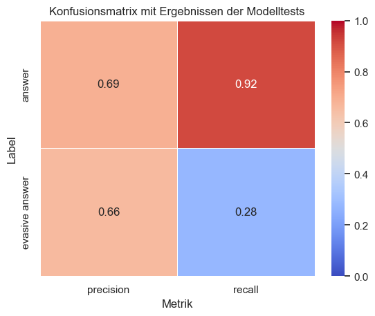

# Klassifikation von Antworten der Abgeordneten

In diesem Projekt analysiere und klassifiziere ich die Antworten von Abgeordneten mithilfe von Daten von Abgeordnetenwatch.de mittels Supervised Learning. Ziel ist es herauszufinden, ob es bestimmte Fragethemen gibt, die Abgeordnete besonders ungern beantworten. Dabei steht nicht das Ignorieren von Fragen im Fokus, sondern das Antworten nur auf einzelne Fragen oder das Verfassen einer Antwort, die die konkrete Frage nicht beantwortet.

## Daten
Als Datengrundlage für die Analyse dient ein selbst gesammelter Datensatz von Fragen, Antworten und weiteren Informationen. Die Daten wurden mittels Webscraping von der Seite Abgeordnetenwatch.de erhoben. Sie wurden am 05.08.2024 gesammelt und umfassen alle Fragen und Antworten der zu diesem Zeitpunkt gewählten Abgeordneten auf Bundes-, Länder- und EU-Ebene. Der Datensatz umfasst einen Zeitraum von Dezember 2004 bis August 2024, wobei die Daten vor ca. 2019 vergleichsweise dünn sind, da nur ein Teil der im Jahr 2024 gewählten Abgeordneten schon in früheren Legislaturperioden gewählt war. Im bereinigten Datensatz, bei dem fehlende Antworten entfernt wurden, sind 46.614 Fragen enthalten.

### Parteien
  
Das Balkendiagramm zeigt die Zahl der beantworteten Fragen nach Partei. Die SPD hat mit 13.332 Fragen die meisten beantwortet, gefolgt von Bündnis 90/Die Grünen mit 10.635 Fragen. Die wenigsten Fragen beantwortet haben die EU-Parteien „Bürger in Wut“ und die „FAMILIEN-PARTEI“. Es ist zu beachten, dass einige Parteien nur auf EU-Ebene antreten und dass die Europawahl 2024 knapp zwei Monate vor der Datenerhebung stattfand. Daher sind für diese Parteien die Zahlen der beantworteten Fragen sehr niedrig. Zudem ist zu erkennen, dass die Regierungsparteien mit deutlichem Abstand die meisten Fragen auf Abgeordnetenwatch.de erhalten und beantwortet haben.

### Themen
Die Zahl der Themen habe ich von 98 auf 13 reduziert. Der größte Teil der Reduktion fand im Bereich Wahlen statt. Hier habe ich die Fragen zu den einzelnen Wahlen pro Legislaturperiode und pro Parlament zu einem einzigen Thema zusammengefasst. Eine detaillierte Übersicht, wie die einzelnen Themen zusammengefasst wurden, findet sich in [exploratory_data_analysis.ipynb](exploratory_data_analysis.ipynb).  

  
Das Balkendiagramm zeigt die Zahl der beantworteten Fragen nach Themen. Am häufigsten wurden Fragen zu den Themen „Politik und Parteien“ (7.095 Fragen) und „Energie und Umwelt“ (6.773 Fragen) gestellt und beantwortet. Die wenigsten Fragen wurden zu den Themen „Bildung und Forschung“ (860 Fragen) sowie „Sport, Kultur, Tourismus“ (424 Fragen) gestellt und beantwortet.

### Parlamente
Die Anzahl der Parlamente habe ich auf die Bundes-, Landes- und EU-Parlamente reduziert, sodass nur noch 18 Parlamente berücksichtigt wurden. Eine detaillierte Übersicht findet sich in [exploratory_data_analysis.ipynb](exploratory_data_analysis.ipynb).  

  
Das Balkendiagramm zeigt die Zahl der beantworteten Fragen nach Parlamenten. Mit großem Abstand wurden die meisten Fragen im Bundestag gestellt und beantwortet (40.255 Fragen), gefolgt von Hamburg mit 884 Fragen. Die wenigsten Fragen wurden in Bremen (83 Fragen) und Mecklenburg-Vorpommern (72 Fragen) gestellt und beantwortet.

## Vorgehen
Für eine Textklassifikation mittels Supervised Learning muss ein Teil des Datensatzes gelabelt sein. Ich habe ein randomisiertes Sample von 2.286 Fällen (knapp 5 % des gesamten Datensatzes) gezogen und per Hand gelabelt. Dafür habe ich folgende Definitionen für die entsprechenden Labels aufgestellt:
- **Antwort:** Alle Antworten, die die gestellte(n) Frage(n) vollumfänglich und konkret beantworten.
- **Ausweichende Antwort:** Alle Antworten, die nur einen Teil der Frage(n) oder keine Frage(n) beantworten, auf andere Kommunikationskanäle verweisen oder so oberflächlich auf die Frage eingehen, dass eine konkrete Antwort nicht deutlich wird.

Nach verschiedenen Vorverarbeitungsschritten enthält das Sample noch 2.281 Fälle. Das Sample wurde in ein Trainings- (80 %), Test- (10 %) und Validierungs-Sample (10 %) aufgeteilt. Mit dem Trainingssample wurde ein Word-Embeddings-Modell trainiert. Hier fiel die Wahl auf fastText, da dieses Modell besonders für morphologisch reichhaltige Sprachen wie Deutsch geeignet ist. Mit dem Test- und Validierungssample wurde das trainierte Modell getestet und untersucht, wie gut es mit unbekannten Daten klarkommt. Zusätzlich wurden verschiedene Bag-of-Words-Modelle trainiert und getestet, jedoch letztlich zugunsten von fastText verworfen.

Die Antworten wurden verschiedenen Preprocessing- und Normalisierungsschritten unterzogen: Zunächst wurde alles kleingeschrieben, Stoppwörter sowie häufig vorkommende, aber sinnfreie Wörter entfernt, die Antworten lemmatisiert und Sonderzeichen eliminiert.

## Ergebnisse

### Händische Klassifikation
  
Die händische Textklassifikation ergab, dass 1.412 (61,9 %) der Antworten eine richtige Antwort gemäß der Definition waren, während 871 (38,1 %) ausweichend waren.

### Automatisierte Klassifikation (Word-Embeddings)
Nach der Optimierung der Hyperparameter für das Word-Embeddings-Modell mit fastText ergab sich folgendes Ergebnis:  

  
Das Modell erzielte für das Label „Antwort“ eine Precision von 0,69 und einen Recall von 0,92. Das bedeutet, dass 92 % der im Testdatensatz enthaltenen Fälle mit dem Label „Antwort“ erkannt wurden. Von allen Fällen, die das Modell mit dem Label „Antwort“ versehen hat, waren 69 % korrekt. Für das Label „ausweichende Antwort“ erreichte das Modell eine Precision von 0,66 und einen Recall von 0,28.

### Vergleich: Händisches vs. automatisches Labeln
Insgesamt erhielten rund 83 % der Antworten im automatisiert klassifizierten Datensatz das Label „Antwort“ und 17 % das Label „ausweichende Antwort“. Im händisch gelabelten Sample lag das Verhältnis bei 62 % („Antwort“) zu 38 % („ausweichende Antwort“). Die Abweichungen und die schlechte Performance des Modells sollten bei der Interpretation der Ergebnisse berücksichtigt werden.

### Themen und unbeantwortete Fragen
Um die Frage zu beantworten, ob es Themen gibt, die Abgeordnete ungern beantworten, wurden die Themen nach dem Anteil der ausweichenden Antworten aufgeschlüsselt:  

  
Am häufigsten wurden Fragen zu „Sport, Kultur und Tourismus“ mit 21,3 % ausweichend beantwortet. Es folgen „Digitales“ (19,4 %) und „Gesundheit und Ernährung“ (19,2 %). Die wenigsten ausweichenden Antworten gab es beim Thema „Migration und Aufenthaltsrecht“ (10,3 %).

## Diskussion
Die vergleichsweise niedrigen Antwortraten beim Thema „Sport, Kultur und Tourismus“ könnten darauf hindeuten, dass das Thema von Abgeordneten als weniger relevant erachtet wird. Umgekehrt könnten die intensiven Debatten über Migration seit 2015 dazu beigetragen haben, dass Abgeordnete Fragen zu diesem Thema besonders ausführlich beantworten wollten – insbesondere, da in dieser Kategorie häufig Fragen zu individuellen Aufenthaltsrechten gestellt wurden.

Die Ergebnisse sollten mit Vorsicht interpretiert werden, da die Datenlage unausgewogen ist und das trainierte Modell keine besonders hohe Performance erzielt hat.
